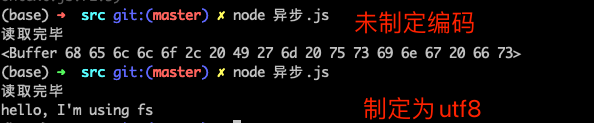

# node-react-mongo
《Node+MongoDB+React项目实战开发》 笔记

## Node基础
### module.exports require

### 系统模块
- fs文件操作模块
```js
fs.readFile(path,encode,callback)
fs.writeFile(path,content,callback)
```
- http模块网络服务模块
- os 操作系统信息模块
```js
```
- path路径处理模块
```js
// path可以抹平不同操作系统的文件系统的差异
// path.join() 用来拼接文件路径
// __dirname 获取绝对路径
path.join(__dirname,'file.txt') 
// 这个获取绝对路径
```


### gulp
- 项目上线,HTML，CSS,JS文件压缩合并
- 语法转换（es6, less, scss）等
- 公共文件抽离，开发阶段的热更新
gulp基于流（stream）的自动化构建工具。webpack是一个文件打包工具，可以把项目中各种JS，CSS等打包合并为一个或者多个文件，主要用于模块化方案和预编译模块方案


### HTTP
- 200 请求成功
- 301 永久重定向，浏览器会有缓存
- 302 临时重定向，浏览器不会记住
- 400 客户端请求语法错误
- 404 请求资源没有被找到
- 500 服务器端错误

### Content-Type
- text/plain
- text/html
- text/css
- application/javascript
- application/json
- image/jpeg

### 静态资源
服务器端不用处理，可以直接响应给客户端的资源就是静态资源
- link href
- script src
- iframe src
- video
- audio

### 动态资源
服务器端根据传入的参数响应内容

### 异步读取文件-使用回调
```js
const fs = require('fs')
fs.readFile('./file.txt',(err,res) => {
    if (err) console.err(err)
    else console.log(res)
})
```


### 异步解决方案
- 回调
- promise
- co + generator
- async + await